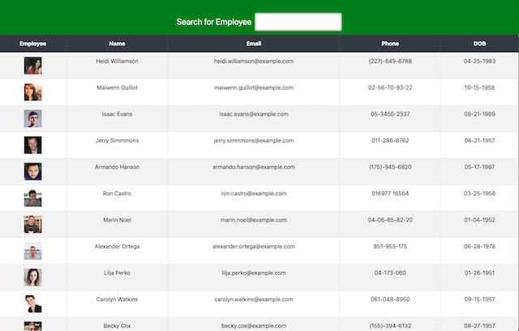

# Directory-Search

** A React app

## Table of Contents

- [Description](#Description)
- [Technologies](#Technologies)
- [Screenshots](#Screenshots)
- [Repository](#Repository)
- [Deployment](#Deployment)

## Description

 This application is build with React and demonstrates an API call to a random user/employee directory site, displaying the API results in a table, and allowing user to dynamically filter that directory by name, dob, phone or email based on keyboard input.

## Technology

- React
- Node.js
- [Random User Generator](https://randomuser.me/)
- [axios-npm](https://www.npmjs.com/package/axios)
- Bootstrap

## Screenshot

 

## Repository

- GitHub Repo/Code: https://github.com/jenneration/directory-search

## Deployment

- [Directory Search App](https://jenneration.github.io/directory-search)